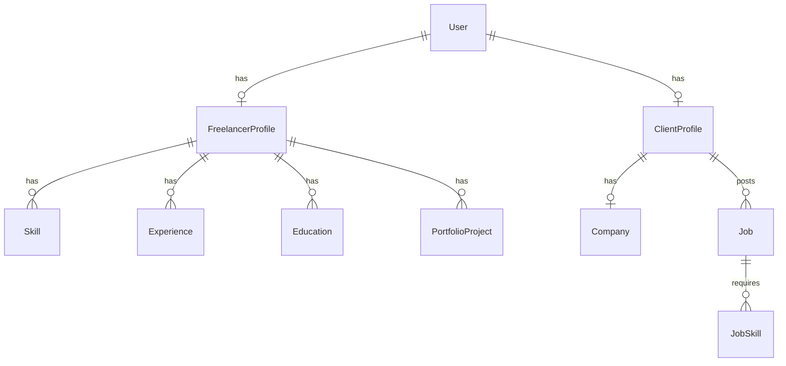

# Database Schema

## ER Diagram

## Models
- **User**: Base account (Email/OAuth, Role).
- **FreelancerProfile**: Bio, hourly rate, location, resume.
  - **Skill**, **Experience**, **Education**, **PortfolioProject**.
- **ClientProfile**: Bio, website, location, logo.
  - **Company**: Industry, size, description.
  - **Job**: Title, description, budget, type (FIXED/HOURLY), status.
    - **JobSkill**.

## Enums
- `Role`: FREELANCER, CLIENT, ADMIN
- `JobStatus`: DRAFT, OPEN, PAUSED, CLOSED
- `JobType`: FIXED, HOURLY
